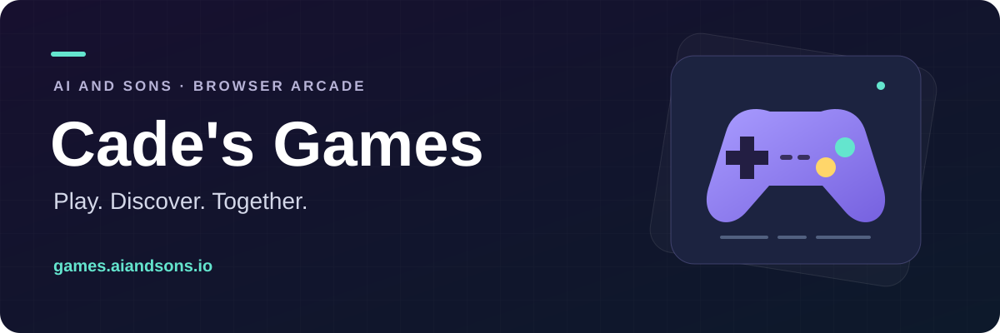

# Cade's Games

A browser arcade made for Cade, with solo games, shared-screen Party Mode, and classroom tools.

**[Play the arcade](https://games.aiandsons.io/)** · **[Start a party](https://games.aiandsons.io/party/)** · **[View the changelog](CHANGELOG.md)** · **[Developer guide](docs/MAINTAINER_GUIDE.md)**

[](https://github.com/LEnc95/games.aiandsons.io/actions/workflows/main-qa.yml) [](https://github.com/LEnc95/games.aiandsons.io/actions/workflows/production-maintenance-verify.yml) [](https://github.com/LEnc95/games.aiandsons.io/actions/workflows/nightly-launch-readiness.yml)

## Explore the arcade

| Play your way | What is already here |
| --- | --- |
| **Find your next game** | A searchable catalog with categories, recent games, and discovery filters. |
| **Bring everyone together** | Party Mode uses a shared display and phone controllers, with rotating activities and reconnect support. |
| **Make progress** | Daily missions, weekly challenges, achievements, and cosmetic inventory. |
| **Use it in class** | Teacher controls, assignment bundles, classroom sessions, and report tools. |
| **Keep your place** | Google sign-in, profiles, cloud-backed account state, and optional family and school billing. |

The catalog lives in [src/meta/games.js](src/meta/games.js). It is the source of truth for game names, routes, and categories; this README avoids a game count that would go stale.

## Run locally

Use **Node.js 22.x**, as specified in [package.json](package.json). GitHub QA currently runs Node 24. From the repository root:

```bash
npm ci
node scripts/qa/static-server.mjs . 4173
```

Open **[http://127.0.0.1:4173](http://127.0.0.1:4173)**. Python's `python -m http.server 4173` is an alternative static server.

This serves the browser files. Account, feedback, billing, and other serverless APIs require a configured backend runtime; multiplayer games also need their Go WebSocket servers. See the [deployment guide](DEPLOYMENT.md) and [multiplayer runbook](v2-server/README.md).

## Check a change

| Command | Purpose |
| --- | --- |
| `npm run game:preflight` | Check catalog routes, discovery metadata, OG cards, sitemap, and maintenance contracts. |
| `npm run test:qa` | Run maintenance, telemetry, shop/billing, feedback/auth, social, and classroom browser checks. |
| `npm run test:launch-readiness-smoke` | Exercise the wider launch flows in a browser. |
| `npm run seo` | Regenerate sitemap, SEO tags, and discovery metadata after catalog changes. |

Install the browser runtime before running browser checks:

```bash
npx playwright install --with-deps chromium
```

The [command reference](AGENTS.md) lists focused suites, raw smoke commands, and operational tasks. The combined QA and launch wrappers start a local server; commands ending in `:raw` expect a server already running on port 4173.

## Repository map

| Area | Entry points |
| --- | --- |
| **Launcher and game catalog** | [index.html](index.html) · [src/meta/games.js](src/meta/games.js) · game folders containing `index.html` |
| **Shared browser code** | [src](src) — account, progression, feedback, discovery, networking, and game helpers |
| **Shop and plans** | [shop.html](shop.html) · [pricing.html](pricing.html) · [school-license.html](school-license.html) |
| **Classroom tools** | [teacher](teacher) · [teacher-onboarding.html](teacher-onboarding.html) |
| **Serverless APIs** | [api](api) — auth, feedback, billing, discovery, social, and aggregate telemetry |
| **Multiplayer servers** | [v2-server](v2-server) · [clubpenguin-world](clubpenguin-world) |
| **Validation and automation** | [tests](tests) · [scripts](scripts) · [GitHub workflows](.github/workflows) |

The browser site uses HTML, CSS, and JavaScript modules. Vercel serves the static site and serverless APIs; Firebase supports authentication, Firestore, and Storage; Stripe supports optional billing. Multiplayer services run separately from the static deployment.

## Build and maintain

Start with [AGENTS.md](AGENTS.md) for repository commands and the [maintainer guide](docs/MAINTAINER_GUIDE.md) for setup, backend configuration, daily-game wiring, and weekly automation.

| Guide | Use it for |
| --- | --- |
| [Deployment](DEPLOYMENT.md) | Static hosting, sitemap generation, routing, cache headers, and environment setup |
| [Party Mode](v2-server/README.md#party-mode-engineering-runbook) | Rooms, roles, reconnects, activity rotation, and recovery |
| [Multiplayer deployment](v2-server/DEPLOY.md) | Separate services, single-instance coordination, and rollout checks |
| [Release checklist](RELEASE_CHECKLIST.md) | Versioning and release validation |
| [Public changelog](CHANGELOG.md) · [Technical changelog](TECHNICAL_CHANGELOG.md) | Player-facing changes and engineering history |

**Privacy boundary:** browser aggregate outcome transmission stays disabled until a release-specific privacy review and explicit runtime enablement. The telemetry API accepts registered, bounded numeric metrics and stores daily summaries. See the [outcome contract details](docs/MAINTAINER_GUIDE.md#engagement-contracts-and-outcome-telemetry).

---

Made for Cade · [Ai and Sons arcade](https://games.aiandsons.io/)

